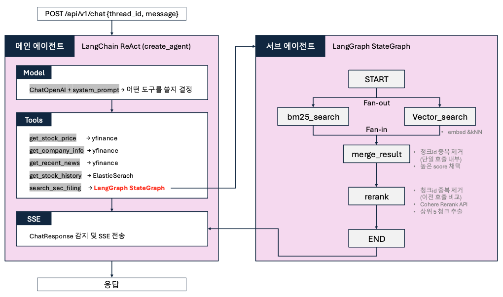

# 주식 분석 AI Agent 개발 — 최종 발표 (요약)

---

## 1. 프로젝트 개요

자연어로 주식 정보를 질문하면 실시간 데이터 또는 공시 문서를 조회해 답변하는 AI 에이전트.

```
사용자: "AAPL의 주요 사업 리스크가 뭐야?"
에이전트: search_sec_filing(AAPL, "사업 리스크") 호출
         → BM25 + kNN 병렬 검색 → 리랭킹 → 상위 5청크 추출
답변:
AAPL의 10-K(2024년 연간 보고서) 기준 주요 사업 리스크는 다음과 같습니다.
1. 글로벌 공급망 집중 리스크: 제조 파트너 및 부품 공급업체가 소수에 집중...
2. 중국 시장 의존도: 매출의 상당 비중이 중국 시장에서 발생...
```

### 기술 스택

| 계층 | 기술 |
|---|---|
| API 서버 | FastAPI + SSE 스트리밍 |
| 메인 에이전트 | LangChain `create_agent` (ReAct) |
| 서브 에이전트 | LangGraph `StateGraph` |
| LLM | OpenAI GPT-4o |
| 실시간 데이터 | yfinance |
| 공시 RAG | Elasticsearch (BM25 + kNN + ES rerank) |
| 평가 | Opik |

### 에이전트 도구(Tool) 목록

| Tool | 데이터 소스 | 설명 |
|---|---|---|
| `get_stock_price` | yfinance | 현재가 + 등락률 |
| `get_company_info` | yfinance | 시가총액·PER·업종 |
| `get_recent_news` | yfinance | 최근 뉴스 최대 3건 (키워드 필터링) |
| `get_stock_history` | Elasticsearch | OHLCV 히스토리컬 데이터 |
| `search_sec_filing` | Elasticsearch (RAG) | SEC 10-K 기반 정성 정보 — 서브 에이전트 |

### 에이전트 페르소나 ([`app/agents/prompts.py`](../../app/agents/prompts.py))

| 영역 | 핵심 규칙 |
|---|---|
| 역할·범위 | 주식·금융 외 질문 거절 / 미지원 기능(배당·전망·추천) 거절 + 가능 기능 안내 |
| 도구 사용 | 도구 조회 없이 수치 직접 생성 금지 |
| 응답 규칙 | 한국어 답변 / 묻지 않은 설명 금지 / search_sec_filing 결과에 회계연도 명시 |

> 응답 규칙은 Opik 평가 결과를 반영해 추가된 항목들 — hallucination·task_completion 점수 개선 목적.

### 아키텍처 흐름



---

## 2. LangGraph 구현 방식

### 메인 vs 서브 에이전트

| 항목 | 메인 에이전트 | 서브 에이전트 |
|---|---|---|
| 흐름 제어 | LLM이 동적으로 도구 선택 (ReAct) | 개발자가 노드·엣지를 정적 정의 |
| 병렬 실행 | 불가 | BM25 + kNN fan-out |
| 체크포인터 | `MemorySaver` (thread_id 기반 대화 이력) | 없음 — stateless |
| cross-invocation 상태 | 체크포인터로 자동 관리 | `_seen_ids_cache`로 직접 관리 |

### subagent-as-tool 패턴

StateGraph 전체를 `@tool`로 감싸 메인 에이전트에 일반 도구처럼 등록. `InjectedToolArg`로 `config`(thread_id 포함)를 LLM 스키마 노출 없이 주입받아 `_seen_ids_cache` 키로 사용.

### 데이터 준비 — RAG 파이프라인 ([`scripts/ingest_10k.py`](../../scripts/ingest_10k.py))

**SEC EDGAR**: SEC(미국 증권거래위원회)가 운영하는 공시 문서 전자 수집 시스템. 미국 상장기업 10-K 의무 제출, API 키 없이 무료 다운로드 가능.

```
EDGAR 다운로드 → HTML 파싱 → 섹션 추출(Item1/1A/7)
  → tiktoken 청킹(512 tokens, overlap 50)
  → text-embedding-3-small 임베딩
  → ES bulk upsert (chunk_id로 멱등성 보장)
```

tiktoken 방식 선택 이유: LLM context window는 토큰 단위 제한 → 청크 크기를 토큰으로 직접 제어하는 것이 예측 가능.

### 검색 방식 — BM25 vs kNN

| | BM25 | kNN |
|---|---|---|
| 원리 | 키워드 빈도 기반 | 의미 유사도 기반 |
| 강점 | 고유명사 ("CUDA", "Blackwell") | 패러프레이징·동의어 |
| 약점 | 동의어에 취약 | 희귀 용어·신조어에 취약 |

```python
_TOP_K = 20            # BM25 / kNN 각각 최대 20개 검색
_NUM_CANDIDATES = 100  # kNN 후보 탐색 범위 (최소 _TOP_K 이상)
_FINAL_TOP_N = 5       # 리랭킹 후 LLM에 전달할 최종 청크 수
```

### 리랭킹

BM25와 kNN의 score는 척도가 달라 단순 비교 불가. 병합 후 ES Inference API(cross-encoder)로 질문과 각 청크 간 실제 관련도 재산출 → Top 5 추출. 미설정 시 score 내림차순 fallback.

> 현재: 교육용 클러스터 라이선스 제한으로 403 → fallback 동작 중.

### `_id` 중복 제거 vs `seen_ids` 제외

| | `_id` 중복 제거 (`merge_results`) | `seen_ids` 제외 (`rerank`) |
|---|---|---|
| 타이밍 | 단일 호출 내부 | 호출 간 (cross-invocation) |
| 목적 | BM25·kNN이 동일 청크를 동시 반환 시 1개만 남김 | 이전 호출에서 이미 반환한 청크 재등장 방지 |

---

## 3. Opik Evaluation

### 평가 레이어 구조

```
Layer 1 (run_eval_sec.py)  서브 에이전트 단독 — 검색 품질
Layer 2 (run_eval.py)      메인 에이전트 E2E  — 답변 품질
```

레이어 분리 이유: E2E 점수만으로는 낮은 점수가 검색 문제인지 LLM 문제인지 구분 불가.

### 메트릭 구성 (5종)

| 메트릭 | 레이어 | 기반 | 점수 방향 |
|---|---|---|---|
| `StockHallucination` | L2 메인 | `Hallucination` | **낮을수록 좋음** |
| `StockAnswerRelevance` | L1·L2 메인 | `AnswerRelevance` | 높을수록 좋음 |
| `StockTaskCompletion` | L2 메인 | `GEval` + 페이로드 패킹 | 높을수록 좋음 |
| `SecRetrievalRelevance` | L1·L2 서브 | `GEval` | 높을수록 좋음 |
| `SecGroundedness` | L2 메인 | `Hallucination` + context | **낮을수록 좋음** |

### SecGroundedness — Hallucination 오탐 해결

기존 `StockHallucination`은 context 없이 수치를 판단해 실시간 도구 결과도 환각으로 오판했다. `SecGroundedness`는 `search_sec_filing` tool output을 context로 직접 캡처·주입. context 없는 항목(실시간 도구)은 `None` 반환으로 채점 skip.

### 평가 결과

| 메트릭 | 이번 (L1) | 2주차 (참고) |
|---|---|---|
| `hallucination_metric` | **0.12** | 0.305 |
| `answer_relevance_metric` | 0.644 | 0.804 |
| `sec_retrieval_relevance` | 0.45 | — |

> L2(21건) 미실시 — ES rerank 403 환경 이슈.

---

## 4. 주요 트러블슈팅

### 1. SEC 10-K 섹션 추출이 목차에서 조기 종료
`re.search()` → 목차 첫 매칭에서 멈춤. `re.finditer()`로 전체 매칭 후 **마지막**(= 본문) 사용.

### 2. stop 패턴이 교차 참조에 매칭
`Item 8` 교차 참조가 stop 패턴에 걸려 섹션 227자에서 잘림. 실제 헤더는 `Item 8.` 형식 → 패턴에 마침표 추가로 구분.

### 3. GEval이 `expected_output` 무시
`GEval.score(output, **ignored_kwargs)` — 추가 인자 전부 버려짐. 페이로드 패킹으로 우회:
```python
payload = f"QUESTION: {input}\nEXPECTED_OUTPUT: {expected_output}\nOUTPUT: {output}"
```
→ task_completion 0.55 → 0.61, 0점 항목 0건.

### 4. JSON 인젝션 (SSE 스트림 파괴)
tool 결과의 `"`, `}` 포함 시 SSE JSON 파괴. `json.dumps(message.content, ensure_ascii=False)` 적용.

### 5. yfinance 뉴스 무관 기사 혼입
yfinance가 섹터·키워드 기반으로 뉴스를 집계 → 티커와 무관한 경쟁사 기사 혼입. 개선 과정:

| 단계 | 변경 내용 | 문제 |
|---|---|---|
| 초기 | 3건 조회 → LLM 필터 | 반환 건수 불안정 |
| 1차 | 30건 조회 → 도구 레벨 키워드 필터 | `"EV" in "seven"` 오탐 |
| 2차 | `\b` 단어 경계 regex 적용 | `_is_recent` 날짜 필터 무력화 |
| 3차 | `content.pubDate` 필드로 수정 | ✅ 현재 안정 |

근본 원인(yfinance 섹터 집계)은 라이브러리 내부 문제 → 완전 해결 불가. Finnhub 대체 가능하나 현재 충분히 안정화되어 **도입 보류**.

---

## 5. 미해결 이슈

| 이슈 | 현상 | 개선 방향 |
|---|---|---|
| `get_stock_history` 30일 데이터 400 오류 | 30행 OHLCV가 히스토리에 쌓인 후 OpenAI 400 | 도구 결과 크기 제한 또는 압축 |
| Hallucination 메트릭 실시간 데이터 오탐 | yfinance 수치를 환각으로 오판 | yfinance tool output도 context로 캡처 |
| ES rerank 403 | 교육용 클러스터 라이선스 제한 | Cohere Rerank 또는 cross-encoder 직접 연동 |

---

## 6. 배운 점

- **StateGraph vs `create_agent()`**: 고정 파이프라인은 StateGraph, 범용 추론은 ReAct — 두 방식을 적재적소에 조합하는 것이 핵심
- **subagent-as-tool**: 복잡한 파이프라인을 `@tool` 하나로 추상화 → 메인 에이전트와 독립적으로 테스트·평가 가능
- **평가 레이어 분리**: 검색 품질(서브)과 답변 품질(E2E)을 분리해야 개선 방향을 정확히 파악할 수 있다
- **메트릭의 한계를 데이터로 보완**: Hallucination 오탐을 context 캡처(SecGroundedness)로 해결 — 메트릭을 맹신하지 않고 설계로 보완하는 사고방식
- **평가 → 원인 분석 → 프롬프트 수정 → 재평가** 사이클을 서브 에이전트 레이어까지 확장
